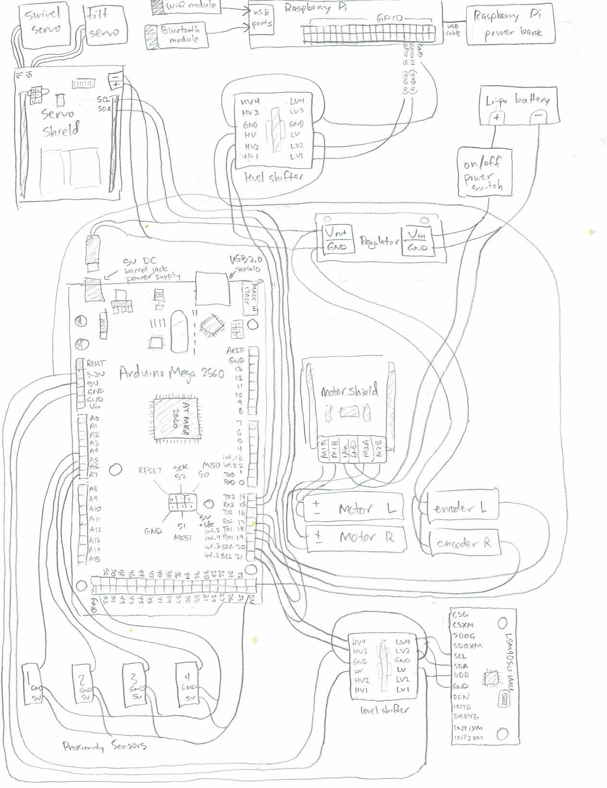
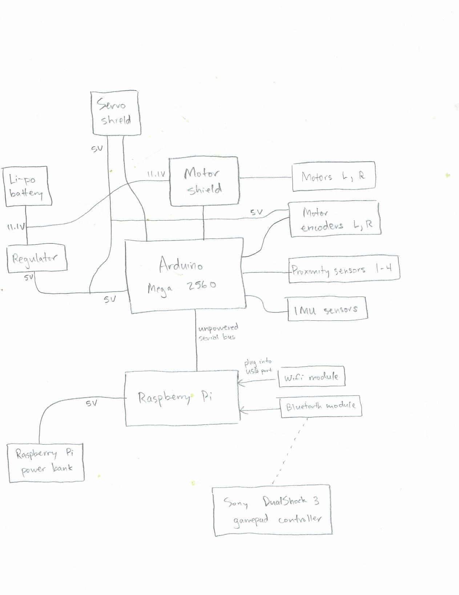
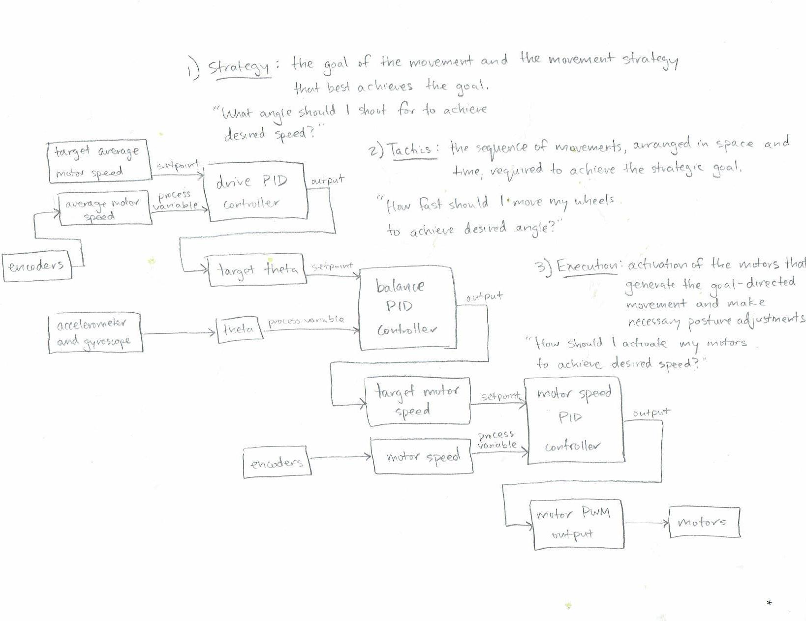
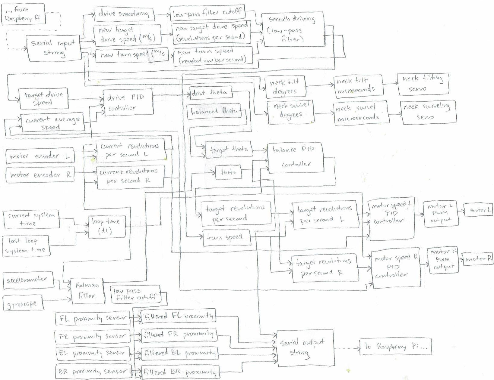

# scratch
_an open-source, autonomously-balancing mobile robot built from scratch_

See it in action [here](https://youtu.be/LrDqXtu8--8)!

## Overview

*scratch* is a self-balancing mobile robotics platform. The robot balances itself on two wheels using IMU sensors and a feedback loop with its motors. It drives using commands dictated from the user via a Sony DualShock 3 gamepad controller. Its balancing functions are handled by an Arduino Mega microcontroller, and its higher-level driving instructions and operations are handled by an on-board Raspberry Pi communicating with the Arduino. The goal of the project is to implement hierarchical control structure and explore the development of complex behavior in a partially autonomous mobile robotics system.

## How it works

### Goal of the self-balancing robot

The task at hand is to create a mobile robot which balances itself on two wheels. This is an implementation of the *inverted pendulum*, a classical problem in dynamics and control theory. The premise is simple: there is a pendulum which has its center of mass above its pivot point. This is an unstable equilibrium point, so in practice it will fall over due to noise in the environment. The goal is to move the pivot point horizontally in such a way that the weight remains upright. Naturally, this model and its variants are also important in the field of robotics and have seen several applications in recent years.

In the case of the self-balancing robot, the task is to drive the two wheels such that the agent maintains an upright, balanced posture. In theory, the problem is fairly straightforward. The agent must first acquire some knowledge of its current position in respect to its desired position. Next, it must calculate the actions needed to achieve its desired position. Finally, it needs to adjust its motor outputs accordingly in order to carry out these actions despite various affecting factors in the environment. This is carried out via a *closed-loop control system*, where actual sensory feedback is integrated with the desired state of the system in order to adjust the system toward its desired state.

In practice a solution is somewhat complicated. The real world poses a suite of complicating factors including sensor noise, computation time, and mechanical slippage. The implications of some of these factors are considered in the section below, where a practical solution to the self-balancing robot is briefly explained.

### Using accelerometer and gyroscope for angle estimate

It is essential that the agent has an awareness of its own position. In the case of the self-balancing robot, this means that the agent must know the angle of its body with respect to vertical at any given point.

To this end, two sensors are applied - the accelerometer and the gyroscope. The accelerometer measures the component of acceleration being experienced along any of the three axes at any given time. When the accelerometer is in a steady state, the primary acceleration experienced is that due to gravity. This essentially allows the accelerometer to tell which way is "down." In our case, the x and z components of the accelerometer are given to be in the plane of the robot as it tips forward and backwards. Thus, given both of these sensor readings, we can use inverse tangent trigonometry to calculate an angle estimate of the body from the accelerometer.

The accelerometer gives relatively low-noise readings, but accumulates bias over time; the gyroscope is very noisy but unbiased. The two sensors are integrated via a Kalman filter to provide a state estimate.

### Lowest level PID loop for motors
A very low-level short-time scale PID controller for each wheel adjusts the raw voltage supplied to the motor in order to achieve a target wheel speed.

### Middle level balancing PID loop
A mid-level PID controller adjusts the motor speed to supply to the low-level PID controller in order to orient the body to a particular target angle.

### Highest level driving PID loop, driving control and filtering
A high-level, longer-time scale PID controller adjusts the target angle to shoot for in order to achieve a target velocity.

The target velocity is given by the user via Playstation controller, and this signal can also be used to bias the robot toward balancing in one location.

### Peripherals such as proximity sensors (with filters) and servo motor neck
The robot is outfitted with a number of proximity sensors which could be used in the future for autonomous navigation. It also has a servo motor neck which points in the direction it is driving. This could be outfitted with a Raspberry Pi camera to do something like optic flow analysis for visual feedback or simple facial recognition using a lightweight convolutional neural network.

### Serial communication
The Arduino and Raspberry PI communicate asynochronously over serial. The Arduino control loop operates on a much faster timestep than the Raspberry Pi, so the Arduino receives a driving command every few loops. The Raspberry Pi waits, every loop, to hear back from the Arduino.

### Raspberry Pi connecting to controller using sixad and pairing with sixpair
The Raspberry Pi must be paired with the Playstation controller using sixad and pairing with sixpair. See [this blog](http://booting-rpi.blogspot.com/2012/08/dualshock-3-and-raspberry-pi.html) for a walkthrough.

## Instructions

### Starting up from completely powered down

#### Visual assessment

1. Visually assess the robot and its connections. Are the batteries charged? Are both battery packs plugged in properly (including the Turnigy lithium-polymer battery being plugged into the low voltage alarm)? Is the serial communication line between the Raspberry Pi and the Arduino intact? Are the servo motors hooked up properly? Are all the screw terminals holding securely? Having any wires become unseated from the protoboards? Are there any loose or fraying wires?

#### Launching the Raspberry Pi

2. Switch on the Raspberry Pi power bank. This can be done by pressing the power button found on the left, outer-facing side of the robot.

3. Gain access to the Raspberry Pi. The Raspberry Pi is running headlessly (which means it is not connected to any monitor, keyboard, mouse, etc.), so it must be controlled somehow. This can be done by hooking up an HDMI monitor and USB keyboard/mouse, or by accessing its command line through a remote secure shell server (enter `ssh pi@192.168.194.240` (or the Pi’s IP address) or `mosh pi@192.168.194.240` (if using the mosh client) into a terminal session connected over the same network, and enter the password, raspberry, when prompted, to connect). *(See appendix 3 for list of useful Linux shell commands).*

4. Launch the script. From the Raspberry Pi shell, enter the command `sudo python3 Programming/Python/Programs/flexibot.py` to launch the program which connects to the Sony DualShock 3 gamepad controller and operates the balancing robot.

5. The program will go through its initialization process. Follow the printed prompts to connect to the controller via Bluetooth. It may take several tries to get the Raspberry Pi to recognize the controller. *If this step is repeatedly unsuccessful, see appendix 4 for troubleshooting).*

6. Once the controller is connected, the Raspberry Pi will open its serial port and begin its communications with the Arduino.

7. At this point, the Raspberry Pi no longer needs to be controlled directly by the user. The monitor, keyboard, and/or mouse can be unplugged or the ssh or mosh session can be terminated. The Pi is now up and ready to go!

#### Launching the Arduino

8. Hold the robot in a straight upright position. This will help it get started off on the right foot, so to speak.

9. Throw the metal toggle switch on the front of the robot from `OFF` to `ON`.

10. The robot will calibrate and initialize itself, which should only take a second or so. The robot will then begin to balance on its own. *(If it does not spring into action at this point, see appendix 4 for troubleshooting).*

11. The system is now entirely operational.

### Operation instructions

#### Using the controller

Now that the robot is up and running, it can be operated by the user with the Sony DualShock 3 gamepad controller:

<table>
  <tr>
    <td>Left joystick left/right (mode 1)</td>
    <td>Turn left/right</td>
  </tr>
  <tr>
    <td>Right joystick up/down (mode 1)</td>
    <td>Drive forwards/backwards</td>
  </tr>
  <tr>
    <td>Left joystick up/down (mode 2)</td>
    <td>Left wheel forwards/backwards</td>
  </tr>
  <tr>
    <td>Right joystick up/down (mode 2)</td>
    <td>Right wheel forwards/backwards</td>
  </tr>
  <tr>
    <td>Left bumper</td>
    <td>Toggle between mode 1 and mode 2</td>
  </tr>
  <tr>
    <td>Right bumper</td>
    <td>Invert controls (aircraft style)</td>
  </tr>
  <tr>
    <td>D-pad up/down</td>
    <td>Increase/decrease speed multiplier by .25 m/s (min 0, default .5, max 1)</td>
  </tr>
  <tr>
    <td>D-pad right/left (!)</td>
    <td>Increase/decrease drive smoothing factor by .1 (min 0, default 1, max 1)</td>
  </tr>
  <tr>
    <td>Start (!)</td>
    <td>Launch/terminate autonomous mode</td>
  </tr>
  <tr>
    <td>Select (!)</td>
    <td>Terminate script</td>
  </tr>
</table>

The controls marked with the *(!)* sign are advanced controls. These should be operated with discretion, by the experienced user:

* It is recommended that maximum drive smoothing is used all the time, for the most stable and safe driving.

* Autonomous mode is highly experimental and subject to potentially destructive failures. It is worth mentioning that any movement of the joysticks at all during autonomous mode will manually override, terminating autonomous mode and giving control back to the user instantly.

* Terminating the script will require regaining access to the Raspberry Pi if the user wishes to relaunch the program.

Finally, pressing down all four buttons (triangle, circle, cross, and square) at the same time momentarily will reboot the Raspberry Pi (note that this does not relaunch the script). Holding these down for 3 seconds will cause the Raspberry Pi to shut down and remain powered off.

#### Driving tips

* When in doubt, go slow. There is generally more stability at slower speeds, and less stability at high speeds.

* Be very cautious when negotiating rough or uneven terrain. This is especially true where there are small gaps or elevated lips on the floor changing from one type of surface to another. If negotiated improperly, these can easily cause the robot to tip over violently. It is best to attempt to drive over these slowly and evenly. It is essential to cross at a 45 degree angle rather than head on so that the obstacle is handled one wheel at a time.

* The robot should be able to handle disturbances such as pushes or kicks to the top fairly well, but there is a limit. Pushing the robot’s wheels or holding them in place will likely cause it to fall over. The mobility of the wheels is the only mechanism by which it is able to balance itself.

* Do not pick up the robot while it is balancing. This disrupts the feedback loop in the robot’s control structure.

* Do not drive the robot into walls, or obstacles that will not allow its wheels to rotate.

* Do not operate on wet, slippery, sandy, or fiery surfaces.

### Powering down

The Arduino and Raspberry Pi have been designed to be capable of operating independently of one another. In other words, the Arduino can be switched on and off (for instance to drive the robot, pick it up and carry it for a while, drive it again) while the Raspberry Pi script is still running and staying connected to the controller. Likewise, the Arduino can operate independently of the Raspberry Pi, in which case the robot will simply balance in place devoid of driving instructions. The two should be able to switch on and off independently of one another.

When the user wishes to completely shut down the system, the following steps should be followed:

1. Switch off the Arduino. Make sure that it is held or properly supported so that it does not fall over.

2. Shut down the Raspberry Pi. This can be done by holding down all four buttons on the controller (triangle, circle, cross, and square) at the same time for three seconds. Otherwise, (such as if the controller has become disconnected, or the program was terminated), it can be done by plugging in a keyboard (or accessing via a remote shell server client) and issuing the shell command `sudo shutdown -h now`. This tells the Raspberry Pi to shut down immediately, and stay powered down (this is called a system halt). The yellow LED activity light on the Raspberry Pi will blink 10 times when it has fully shut down.

* *Important note:** It is absolutely imperative that the Raspberry Pi is properly shut down before its power supply is removed! Improper shutdown or simply switching off its power supply/pulling the plug can corrupt its filesystem, with the possibility of irreparably damaging the SD card and losing everything.

3. It is now safe to switch off the Raspberry Pi’s power bank. Hold the power button on the left outward-facing side of the robot for approximately one second until the power bank’s blue LED bars stop glowing.

4. The system is now entirely shut down.

### Battery management and storage

One crucial element to the long-term use and operation of the robot is proper management of the batteries powering the various devices making up the system.

#### Sony DualShock 3 gamepad controller battery

The controller operates wirelessly, so it must be recharged on occasion. Typically, a full charge will last for hours of use and takes only about 20-30 minutes. To charge, simply use a USB 2.0 A-male to mini-B cable to plug the controller into the Raspberry Pi when it is powered on. Note: the controller can be charged by plugging into some other devices, but this will cause it to become unpaired with the Raspberry Pi. It will have to be physically re-paired again with the Raspberry Pi after charging on another device.

#### Raspberry Pi power bank

Make sure that the Raspberry Pi is properly shut down before turning off the power bank and removing the USB power connection between the bank and the Raspberry Pi. The power bank can be recharged by plugging into a USB port or USB wall adapter with a USB 2.0 A-male to micro-B cable. The bank does not support through-charging, so it cannot be both charged and used to power the Raspberry Pi at the same time. The blinking blue LED bars on the side of the bank indicate its level while charging; when all the bars are on and no longer blinking, the bank is full.

#### Turnigy lithium-polymer battery

First of all, lithium-polymer batteries are volatile and highly dangerous if used improperly. It is strongly recommended that the user educate themselves on proper care, use, and storage of these batteries before operating the robot in any way.

The low voltage alarm will indicate when the battery needs to be recharged. Do not continue to operate the robot once the alarm has indicated that the cells are reaching low voltages, or else the battery may be irreparably damaged. 

To recharge the battery, the user should first completely shut down the robot. Then the battery can be carefully unplugged from the robot and removed from the chassis.  The battery should be charged using a proper lithium-polymer balance charger. Lithium-polymer batteries should never be charged unsupervised because of the risk of fire or explosion. Once the battery is charged, it can be once again carefully plugged back into the robot. Remember to plug it into the low voltage alarm as well, ensuring that it is connected with the proper polarity.

#### Storage

There are a few things to consider when storing the robot inactively for extended periods of time. 

First of all, the Raspberry Pi should be properly shut down and the Raspberry Pi power bank should be completely turned off.

Next, the battery should be unplugged from the low voltage alarm. If it remains plugged in, the alarm (which has several LEDs) will continue to sap power from the battery until it is completely dead. If a lithium-polymer battery is drained completely, it becomes irreparably damaged and is effectively rendered worthless. It is thus essential that the battery does not remain plugged into the low voltage alarm if it is not being used in the near future.

Furthermore, lithium-polymer batteries should not be stored for long periods of time at full charge or at low charge, or else the health of the battery will be adversely affected. Thus, the battery must be stored at a partial charge. This can be done by choosing the "STORAGE" setting on the balance charger, which will bring the cells to a proper voltage for safe and healthy long-term storage.

## Current known issues

*Serial communications breakdown may occur between the Arduino and the Raspberry Pi.* They are communicating at very high baud rates with very rapid control loops.

*The WiFi module on the Raspberry Pi sometimes does not work properly, and the Raspberry Pi can have issues connecting to the internet even with a wired internet connection.* This may be due to the Bethel ITS department’s current work on restructuring the network.

*The robot may struggle to balance on rough terrain or when encountering large disturbances.* Continuing work is being done on optimizing the balancing control algorithms.

*The servo motor head will sometimes become unresponsive while the rest of the robot continues to work properly.* This rare issue is likely caused by some sort of communication disruption between the Arduino and the ServoShield.

*Autonomous mode is still in the earliest stages of development.* The robot does not yet demonstrate advanced or even particularly successful autonomous behavior over extended periods of time.

## Future improvements

### Hardware

A small LCD touch screen will be mounted to the servo neck of the robot, as well as a PiCamera to be operated by the Raspberry Pi script. 3D print designs for these mounting cases have already been designed. The screen could be used to operate the Raspberry Pi easily, or display some type of robotic face or video stream. The camera could be used to capture images and video and save them to the Raspberry Pi’s filesystem. It also opens up the possibility for types of object recognition or machine vision to be incorporated in the future.

### Software

Now that a solid hardware robotics platform has been developed for the most part, the main future developments will be on the software side. The goal is to pursue deeper levels of autonomy in the form of hierarchical control structure, developing more advanced behaviors and combinations of reflex arcs. Measures may be taken to model functions of the human central nervous system in developing an efficient and effective control structure. Hopefully this system can be used as a platform to study real-world implementations of reinforcement learning, statistical learning, pattern recognition, localization and mapping, and other types of machine learning and artificial intelligence.

## Parts list

### Frame/Chassis

* M3 frame bolt *(numerous)*

* M3 nut *(numerous)*

* aluminum M3 L-bracket connector piece *(numerous)*

* aluminum M3 45-degree connector piece *(numerous)*

* aluminum M3 right angle connector piece *(numerous)*

* 4.0 cm aluminum frame piece *(x4)*

* 6.0 cm aluminum frame piece *(x5)*

* 10.0 cm aluminum frame piece *(x4)*

* 15.0 cm aluminum frame piece *(x6)*

* 20.0 cm aluminum frame piece *(x2)*

* [Actobotics 1.50" aluminum channel](https://www.sparkfun.com/products/12383)

  -fits perfectly around Turnigy lipo battery to hold it in using friction

* bottom chassis plate (with mounting holes for motors)

* neck chassis plate (with mounting holes for servo motor neck)

* 3M double-sided foam adhesive tape

* foam padding

* toggling power switch for Arduino power supply

* mounting board for Raspberry Pi (Sketchup files included)

* mounting board for Arduino

* mounting board for power regulator

* 4-40 standoff bolt (plastic) *(numerous)*

* 4-40 nut (plastic) *(numerous)*

* 4-40 washer (plastic) *(numerous)*

### Power supply

* [Turnigy 2200 mAh 3s 20C lithium-polymer battery pack](http://www.google.com/url?q=http%3A%2F%2Fwww.amazon.com%2FTurnigy-2200mAh-20C-Lipo-Pack%2Fdp%2FB0072AEY5I%2Fref%3Dsr_1_1%3Fie%3DUTF8%26qid%3D1439567180%26sr%3D8-1%26keywords%3Dturnigy%2B2200%2Bmah%2Blipo&sa=D&sntz=1&usg=AFQjCNF5dib2UrzGPrWb_GFaAW4P7uDTdw)

  -power supply for Arduino, its peripherals, DC motors and all lower-level sensors

* [AmazonBasics 5600 mAh portable power bank](http://www.amazon.com/AmazonBasics-Portable-Power-Micro-Cable/dp/B00LRK8HJ8)

  -power supply for Raspberry Pi and its peripherals

* [HobbyKing lipoly low voltage alarm](http://www.hobbyking.com/hobbyking/store/__18987__On_Board_Lipoly_Low_Voltage_Alarm_2s_4s_.html)

  -connected to lipo battery, alerts user when battery reaches low voltages

* [Polulu step-down voltage regulator D15V70F5S3](https://www.pololu.com/product/2111)

  -takes 11.1V from lipo battery and drops it to 5V to power Arduino and its sensors

### Arduino

* Arduino Mega 2560

  -the central microprocessing unit of the balancing sensors and control structure

* [Sparkfun MegaShield kit](https://www.sparkfun.com/products/9346)

  -prototyping shield for Arduino Mega

* [Sparkfun 3.3-5V bi-direction logic level converter](https://www.sparkfun.com/products/12009)

  -for interfacing Arduino serial communication (operating at 5V) with Raspberry Pi GPIO serial communication (operating at 3.3V)

* [Mini modular breadboard](https://www.sparkfun.com/products/12043) *(x2)*

  -adhesively attached to MegaShield for prototyping on the Mega

### DC motor control

* [Polulu dual MC33926 motor drive shield for Arduino](https://www.pololu.com/product/2503)

  -contains H-bridge circuitry to operate the DC motors to provide balancing functions

  -capable of operating at relatively high currents without heating up significantly

  -no heatsink needed

* Brushed DC motor with optical encoder *(x2)*

* [BaneBots 4 7/8 robot wheel](http://banebots.com/pc/WHB-WS-498/T80P-494BO-U3) *(x2)*

### Sensors

* [Sparkfun 9DOF LSM9DS0 IMU breakout](https://www.sparkfun.com/products/12636)

  -combined accelerometer/gyroscope/magnetometer sensor used for calculating an estimated angle of the robot, configured to communicate with Arduino via I2C protocol

  -*important:* operates at 3.3V

* [Sparkfun 3.3-5V bi-direction logic level converter](https://www.sparkfun.com/products/12009)

  -for interfacing Arduino I2C (operating at 5V) with LSM9DS0 I2C (operating at 3.3V)

* [Sharp GP2Y0A41SK0F short range infrared proximity sensor](https://www.sparkfun.com/products/12728) *(x4)*

  -two placed on front of robot facing forwards, two placed on back of robot facing backwards

  -used to help robot detect objects in autonomous exploration mode

* [Infrared sensor jumper wire](https://www.sparkfun.com/products/8733) *(x4)*

* [Mini modular breadboard](https://www.sparkfun.com/products/12043) *(x2)*

  -prototyping space where IMU sensor and its level shifter are wired

  -adhesively attached to back of battery mount, centered directly on axis with the wheelbase between DC motors

### Servo motor control

* [Renbotics ServoShield V2.0](http://www.seeedstudio.com/depot/Renbotics-ServoShield-V20-p-1299.html)

  -configured to communicate with Arduino via I2C in order to control up to 16 servos

  -*important:* the printed labels on the hardware channels 1-16 actually correspond to software channels 0-15; this discrepancy is handled in the Arduino program

* Servo motor *(x2)*

  -these servos provide 2 degrees of freedom for the neck: tilting forwards to backwards, and swiveling left to right

* Servo neck mounting pieces

### Raspberry Pi

* [Raspberry Pi 2 Model B](https://www.raspberrypi.org/products/raspberry-pi-2-model-b/)

  -the central high-level control unit taking wireless commands from controller via Bluetooth, and communicating them to Arduino via serial on GPIO pins

* [SanDisk Ultra 16GB microSDHC Class 10 memory card](http://www.bestbuy.com/site/sandisk-ultra-16gb-microsdhc-class-10-memory-card-black/4120107.p?id=1218457270079)

  -memory card housing filesystem for Raspberry Pi

* [Bluetoth 4.0 USB module](https://www.adafruit.com/products/1327)

  -provides Bluetooth capabilities for wireless communication with Sony DualShock 3 gamepad controller

* [Miniature WiFi (802.11b/g/n) module](https://www.adafruit.com/products/814)

  -provides WiFi capabilities to Raspberry Pi

  -especially useful for setting up remote SSH server (this [mosh mobile shell client](https://mosh.mit.edu/) is highly recommended) in order to remotely access Raspberry Pi command shell

  -also useful for setting up a remote VNC server (this [RealVNC remote VNC viewer](https://www.realvnc.com/) is highly recommended) in order to remotely access Raspberry Pi X-server desktop (the graphic user interface launched via "startx" command)

  -these features offer fantastically flexible operation of the Raspberry Pi; it can be controlled headlessly and wirelessly in the robot without the need to physically plug in a keyboard, mouse and monitor every time the user must execute a command, launch a script, properly shut down, etc.

* [Sony DualShock3 wireless gamepad controller](http://www.amazon.com/PlayStation-Dualshock-Wireless-Controller-Black-3/dp/B0015AARJI)

  -operated by user to drive the robot

  -communicates wirelessly with Raspberry Pi via Bluetooth

### Essential development tools and peripheral devices

* [IMAX B6 Lipro digital balance charger](http://www.amazon.com/Original-Lipro-Digital-Balance-Charger/dp/B006TT49O4)

  -used to charge/balance/store/discharge lithium-polymer batteries

* operating system running Arduino IDE environment

  -for developing and uploading Arduino source code to robot (written in Arduino C/C++)

* USB 2.0 A-male to B-male cable

  -for connecting Arduino to computer for uploading source code and serial monitoring

* HDMI-capable external monitor

  -for graphic display of Raspberry Pi during development

* USB keyboard

  -for keyboard control of Raspberry Pi during development

* USB mouse

  -for mouse control of Raspberry Pi during development

* USB 2.0 A-male to mini-B cable

  -for connecting Sony DualShock 3 gamepad controller to Raspberry Pi for charging and initial pairing process

* USB hub

  -allows several USB peripherals to connect to Raspberry Pi over one USB port

## Wiring connections and pinout

### Wiring diagram

*(See appendix 1.1.)*

### Pinout list

#### Arduino pinout

<table>
  <tr>
    <td>Analog input 0</td>
    <td>Motor L current sensing</td>
  </tr>
  <tr>
    <td>Analog input 1</td>
    <td>Motor R current sensing</td>
  </tr>
  <tr>
    <td>Analog input 4</td>
    <td>Front-left proximity sensor reading</td>
  </tr>
  <tr>
    <td>Analog input 5</td>
    <td>Front-right proximity sensor reading</td>
  </tr>
  <tr>
    <td>Analog input 6</td>
    <td>Back-left proximity sensor reading</td>
  </tr>
  <tr>
    <td>Analog input 7</td>
    <td>Back-right proximity sensor reading</td>
  </tr>
  <tr>
    <td>Digital 4</td>
    <td>Motor shield enable pin</td>
  </tr>
  <tr>
    <td>Digital 7</td>
    <td>Motor L direction pin</td>
  </tr>
  <tr>
    <td>Digital 8</td>
    <td>Motor R direction pin</td>
  </tr>
  <tr>
    <td>Digital 9</td>
    <td>Motor L pulse width modulation pin</td>
  </tr>
  <tr>
    <td>Digital 10</td>
    <td>Motor R pulse width modulation pin</td>
  </tr>
  <tr>
    <td>Digital 12</td>
    <td>Motor fault flag pin</td>
  </tr>
  <tr>
    <td>Digital 14 (Tx3)</td>
    <td>Serial communication with Raspberry Pi (Tx)</td>
  </tr>
  <tr>
    <td>Digital 15 (Rx3)</td>
    <td>Serial communication with Raspberry Pi (Rx)</td>
  </tr>
  <tr>
    <td>Digital 16</td>
    <td>Encoder L direction reading</td>
  </tr>
  <tr>
    <td>Digital 17</td>
    <td>Encoder R direction reading</td>
  </tr>
  <tr>
    <td>Digital 18 (interrupt 5)</td>
    <td>Encoder L interrupt pin</td>
  </tr>
  <tr>
    <td>Digital 19 (interrupt 4)</td>
    <td>Encoder R interrupt pin</td>
  </tr>
  <tr>
    <td>Digital 20 (SDA)</td>
    <td>Data signal for I2C communication</td>
  </tr>
  <tr>
    <td>Digital 21 (SCL)</td>
    <td>Clock signal for I2C communication</td>
  </tr>
</table>

#### ServoShield pinout

<table>
  <tr>
    <td>Hardware pin 15/Software pin 14</td>
    <td>Neck tilting servo motor</td>
  </tr>
  <tr>
    <td>Hardware pin 16/Software pin 15</td>
    <td>Neck swiveling servo motor</td>
  </tr>
</table>

#### Raspberry Pi pinout

<table>
  <tr>
    <td>Pin #6/GND</td>
    <td>Serial communication with Arduino (ground)</td>
  </tr>
  <tr>
    <td>Pin #8/GPIO14 (TxD0)</td>
    <td>Serial communication with Arduino (Tx)</td>
  </tr>
  <tr>
    <td>Pin #10/GPIO15 (RxD0)</td>
    <td>Serial communication with Arduino (Rx)</td>
  </tr>
</table>

### Device connection diagram

*(See appendix 1.2.)*

## Appendices

### 1.1 Wiring diagram

This diagram shows the electrical circuit connections of the entire system.

### 1.2 Device connection diagram

This diagram shows the overall connections between the various devices in the system. The hope is to give a general overview of which components are connected to each other, and how they are working together.

### 2.1 Hierarchical PID structure

This diagram shows the hierarchical nature of the primary PID controllers used in the system--a technique known as cascading PID control. The design of this system is modeled after the human central nervous system, where the brain influences the activity of the spinal cord to command voluntary movements. This is done through a hierarchy of control levels: *strategy* (represented by the association areas of neocortex and basal ganglia of the forebrain), *tactics* (represented by the motor cortex and cerebellum), and *execution* (represented by the brain stem and spinal cord).

### 2.2 Control process block diagram

This diagram shows the flow of all control process occurring simultaneously in the robot.

### 3. Useful Linux shell commands

`startx`: used to launch the graphic user interface (starts the X server which is the desktop)

`cd`: ‘call directory,’ navigates to the home directory

`cd ..`: navigates to the parent directory (up one folder)

`ls`: ‘library show,’ shows the contents of the current directory

`rm`: ‘remove,’ used to remove a file or directory

`sudo`: ‘superuser do,’ a powerful prefix that carries out any following command with superuser privileges (used when a command is being denied due to lack of permissions)

`sudo apt-get update`: connects to the internet and automatically downloads the latest updates for the distribution, should be run periodically and before major installments

`sudo service bluetooth status`: returns the current status of Bluetooth

`hciconfig`: displays useful information regarding Bluetooth functionality

`sudo ./sixpair`: runs an executable file pairing the Sony DualShock 3 gamepad controller with the Raspberry Pi (essentially performs a handshake with the controller)

`ifconfig`: displays useful information regarding network connection and various network devices such as ethernet and WiFi chips; can be used to find out current IP address

`sudo nano /etc/network/interfaces`: allows user to access and edit a text file containing important network configuration options; this is the file that must be used to set up a static IP address

`sudo reboot`: immediately reboots the Raspberry Pi

`sudo shutdown -h now`: immediately shuts down the Raspberry Pi and enters system halt mode where the filesystem is unmounted and the Raspberry Pi will stay powered down; it is then safe to unplug power supply

### 4. Troubleshooting

#### Raspberry Pi issues

*The Raspberry Pi boots up to a black screen.*

Check that the Raspberry Pi power bank is fully charged (all four blue LED bars are lit). Sometimes the Raspberry Pi needs to be operating on a fully charged battery to supply the power needed to launch the graphic user interface. Once the Pi is up and running, however, the power bank can generally run down without issue.

*The Linux shell is giving the error message *command not recognized* (or some similar variant).*

Check that the command is typed out exactly properly, letter for letter. Make sure that the user is currently in the correct folder, if attempting to carry out a particular command or access a particular file. See appendix for a list of useful Linux shell commands.

*The Python script repeatedly fails to connect to the Sony DualShock 3 gamepad controller.*

This could happen for a variety of reasons:

-Check that the Sony DualShock 3 gamepad controller is charged and working. The four red LED lights on the front should flash on and off when the PlayStation button is pressed.

-Try powering the controller off and back on again. Hold down the PlayStation button for approximately 10 seconds to shut off the controller, then try connecting again.

-Make sure that the Bluetooth chip is working properly. Enter the shell command sudo service bluetooth status and the response should be bluetooth is enabled. if Bluetooth is working correctly.

-If these are not the issue, the controller may need to be physically re-paired with the Raspberry Pi. This is the case if the controller has been plugged into another computer for charging, or has been used on another device. Follow these instructions in the Linux shell:

Enter the command cd in order to navigate to the home directory.

Enter the command cd Programming to navigate to the directory called "Programming". This directory contains an executable file called “sixpair”.

Plug the controller into the Raspberry Pi using a USB 2.0 A-male to mini-B cable.

Run the command sudo ./sixpair in order to pair the two devices. If they have paired successfully, the output should look similar to this:

Current Bluetooth master: DE:AD:BE:EF:00:00

Setting master bd_addr to**: 00:1F:81:00:06:2**

Now that the devices have been paired, the controller can be unplugged from the Raspberry Pi.

Navigate back to the home directory with the command cd and execute the script sudo python3 Programming/Python/Programs/flexibot.py again in order to re-attempt connecting the controller wirelessly.

-If these measures are unsuccessful, try following the instructions found in [this guide](http://booting-rpi.blogspot.com/2012/08/dualshock-3-and-raspberry-pi.html).

*The robot is up and balancing, but the Sony DualShock 3 gamepad controller does nothing.*

This means that the Arduino is working properly in balancing the robot, but it is not receiving driving commands from the Raspberry Pi. This could be because the Raspberry Pi has stopped running its script, or the script is still running and the controller is not being detected by the Raspberry Pi. Try re-starting the script.

In any case, the Arduino is programmed to simply stop and balance in place in the absence of driving commands from the Raspberry Pi. *Informational note:* in qualitative experiments, the Bluetooth communication between the controller and the robot demonstrated an impressive range. It is likely that the robot would drive out of sight before its connection to the controller would be dropped.

#### Arduino issues

*When switching on the Arduino, the red power LED turns on but the robot does not start balancing.*

This issue is suspected to occur occasionally when the Arduino’s Serial3 buffer has been filled up by data streaming from the Raspberry Pi. This prevents the Arduino from going through its normal initialization process and launching its code, springing into action. Try switching off the Arduino, carefully unplugging the ribbon cable serial connection to the Raspberry Pi, and firmly plugging it back in again. Try switching on the Arduino again.

*The robot sort of balances, but it begins to drive itself in circles and falls over.*

This nasty issue occurs when the motor encoder on one of the wheels is not providing proper feedback. Try carefully observing the electrical activity on pins 16-19 with an oscilloscope while manually rotating the wheels to check if everything is working properly. The line in the Arduino source code responsible for driving the motors normally must be commented out in order to try this.

#### Hardware issues

*The robot is balancing somewhat well, but one of the wheels is a little bit jerky; almost as if it is lagging behind the other wheel.*

Switch off the robot and check that both wheels are tightened into the axle properly. If a wheel has become loose, it must be removed off and the axle must be tightened with a small hex key.

## Acknowledgments

Thanks to Profs. Nathan Lindquist and Adam Johnson at Bethel University for their mentorship and guidance throughout this project.